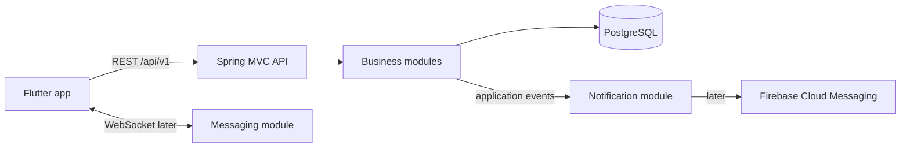

# Architecture Proposal

**Status:** Draft — discuss before implementation.

## Architectural Style

Use a **feature-first modular monolith**: one Spring Boot deployment, one Gradle application, and one PostgreSQL database, split into explicit logical business modules. Each top-level feature package is an application module with an owned model, use cases, API, and persistence concerns.

In this documentation, “multimodule” means logical feature modules, not separate Gradle subprojects. This keeps startup, local development, transactions, migrations, and dependency management simple while establishing boundaries that can later support physical extraction. Separate Gradle modules may be introduced only when independent dependency sets, build isolation, or team ownership make the added complexity worthwhile. The accepted decision is recorded in [ADR-0001](decisions/0001-feature-first-modular-monolith.md).

Do not introduce microservices, Kafka, or Redis until measured requirements demand them.

Organize the root package by feature rather than global technical folders such as `controller`, `service`, and `repository`:

```text
dev.dkutko.owlnest
├── identity       # external identity mapping and authorization
├── profile        # public user profile
├── socialgraph    # follows, friend requests, friendships
├── post           # posts, comments, likes, reposts
├── feed           # chronological feed queries
├── messaging      # conversations, messages, WebSocket delivery
├── notification   # in-app notifications and FCM adapter
└── shared         # small technical concerns only: errors, time, IDs
```

Inside a feature, use pragmatic layers only when needed:

```text
post/
├── api/            # controllers and request/response DTOs
├── application/    # use cases and transaction boundaries
├── domain/         # business rules and domain types
└── infrastructure/ # JPA repositories and external adapters
```

Controllers must not expose JPA entities. Application services coordinate use cases; repositories hide persistence details. Keep domain code free of Spring dependencies where this avoids real coupling, but do not duplicate simple models merely to claim architectural purity.

Code outside a feature must interact through that feature's explicit application API or published events, not by reaching into another feature's persistence or internal implementation. We can later add Spring Modulith verification if package boundaries become difficult to enforce through review and tests alone.

## Runtime Shape



PostgreSQL is the source of truth, including messages. WebSocket is a live-delivery channel; REST provides conversation history and recovery after reconnects. Start feeds chronologically with cursor pagination. Store timestamps as UTC `Instant` values and use UUID identifiers.

## Security Direction

Prefer a dedicated identity provider for registration, credentials, email verification, password recovery, and token issuance. This application then acts as an OAuth2 Resource Server that validates JWTs and owns a local profile keyed by the token subject (`sub`). This matches the dependency already present and avoids implementing security-sensitive token flows inside business code. The provider choice requires an ADR before the first auth slice; Keycloak and Firebase Authentication are candidates. Firebase Authentication is not required to use FCM.

## Module Interaction

Use direct application-service calls when one module needs an immediate result. Use in-process application events for secondary effects such as `PostLiked` creating a notification. Add a durable outbox only when delivery to FCM or other external systems becomes a real reliability requirement.

Friendship and follow relationships remain separate: follow is directional; friendship requires request and acceptance and is symmetric after acceptance. External sharing is initially a Flutter/client responsibility unless server-side analytics becomes a requirement.

## Delivery Roadmap

1. **Foundation:** local profiles, configuration profiles, Flyway baseline, error format, security decision, API versioning, test strategy.
2. **Identity and profile:** authenticated current-user profile and profile editing.
3. **Social graph:** follow/unfollow, friend request, accept/reject, list relationships.
4. **Publishing:** create/read/delete text posts and comments with ownership rules.
5. **Engagement and feed:** likes, reposts, chronological cursor-paginated feed.
6. **Notifications:** in-app notification records, then FCM device tokens and push delivery.
7. **Messaging:** conversations and persisted text messages over REST, then WebSocket live delivery.

Each step should be a vertical slice containing migration, domain behavior, API contract, authorization, tests, and documentation.

## Decisions Required Before Coding

- Identity provider and Flutter login flow.
- Public username, display-name, and profile-visibility rules.
- Whether friendship and follow can coexist independently.
- Post deletion/editing policy and repost/comment behavior after deletion.
- Initial feed visibility and blocking/privacy rules.
