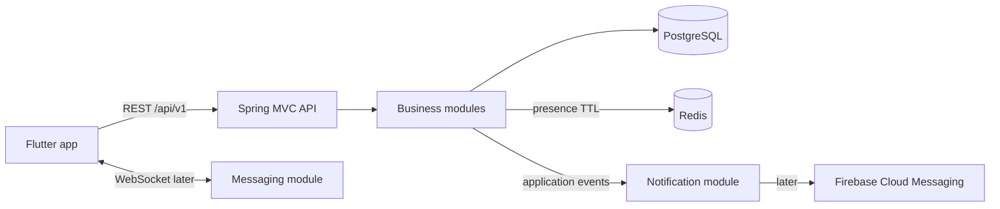

# Architecture Proposal

**Status:** Draft — discuss before implementation.

## Architectural Style

Use a **feature-first modular monolith**: one Spring Boot deployment, one Gradle application, and one PostgreSQL database, split into explicit logical business modules. Each top-level feature package is an application module with an owned model, use cases, API, and persistence concerns.

In this documentation, “multimodule” means logical feature modules, not separate Gradle subprojects. This keeps startup, local development, transactions, migrations, and dependency management simple while establishing boundaries that can later support physical extraction. Separate Gradle modules may be introduced only when independent dependency sets, build isolation, or team ownership make the added complexity worthwhile. The accepted decision is recorded in [ADR-0001](decisions/0001-feature-first-modular-monolith.md).

Do not introduce microservices or Kafka until measured requirements demand them. Redis is used only for the accepted short-lived online-presence requirement; PostgreSQL remains the source of truth for durable business data.

Organize the root package by feature rather than global technical folders such as `controller`, `service`, and `repository`:

```text
dev.dkutko.owlnest
├── identity       # external identity mapping and authorization
├── profile        # public user profile
├── presence       # Redis-backed online status
├── socialgraph    # follows, friend requests, friendships
├── post           # posts, comments, likes, reposts
├── feed           # chronological feed queries
├── media          # media metadata and external object-storage lifecycle
├── messaging      # conversations, messages, WebSocket delivery
├── notification   # in-app notifications and FCM adapter
└── shared         # small technical concerns only: errors, time, IDs
```

Inside a feature, use the familiar Controller/Service/Domain/Repository package names. Create only the packages a feature actually needs:

```text
post/
├── controller/ # REST controllers, request/response DTOs, exception handlers
├── service/    # use cases, orchestration, and transaction boundaries
├── domain/     # business rules, entities, and domain value types
└── repository/ # repository interfaces and JPA/Redis implementations
```

Controllers must not expose JPA entities. Services coordinate use cases; repositories hide persistence details. Keep domain code free of Spring dependencies where this avoids real coupling, but do not duplicate simple models merely to claim architectural purity. Technical concerns that are not repositories, such as Spring Security configuration, may use an explicit package such as `security`.

Code outside a feature must interact through that feature's public service classes or published events, not by reaching into another feature's repository implementation. We can later add Spring Modulith verification if package boundaries become difficult to enforce through review and tests alone.

## Runtime Shape



PostgreSQL is the source of truth, including messages. Redis holds only ephemeral online-presence keys that expire automatically. WebSocket is a live-delivery channel; REST provides conversation history and recovery after reconnects. Start feeds chronologically with cursor pagination. Store timestamps as UTC `Instant` values and use UUID identifiers.

## Security Direction

Use Keycloak as the dedicated identity provider for registration, credentials, email verification, password recovery, and token issuance. OwlNest Backend acts only as an OAuth2 Resource Server: it validates JWT access tokens and maps the external token subject (`sub`) to a local account UUID. Business tables reference the local UUID, not the Keycloak subject.

Login, logout, refresh, and registration remain between Flutter and Keycloak. The backend owns authorization rules, local account provisioning, and product profile data. This decision is recorded in [ADR-0002](decisions/0002-use-keycloak-as-identity-provider.md); the contract and implementation blueprint live in [Authentication](features/authentication.md) and [Authentication Implementation Plan](features/authentication-implementation-plan.md).

Google identity brokering remains compatible with this boundary but is deferred until after the core social features. The current email/password flow is sufficient for the active roadmap.

## Module Interaction

Use direct service calls when one module needs an immediate result. Use in-process application events for secondary effects such as `PostLiked` creating a notification. Add a durable outbox only when delivery to FCM or other external systems becomes a real reliability requirement.

Friendship and follow relationships remain separate: follow is directional; friendship requires request and acceptance and is symmetric after acceptance. External sharing is initially a Flutter/client responsibility unless server-side analytics becomes a requirement.

## Media Storage

The implemented first managed-media slice supports private profile avatars in Cloudflare R2. PostgreSQL stores ownership, immutable declared and observed metadata, lifecycle state, cleanup leases, and the profile association; object bytes remain in a private bucket. The backend issues short-lived authenticated capabilities but does not proxy upload or download bodies.

The direct-upload flow is reservation, presigned create-only `PUT`, R2 metadata confirmation, atomic avatar activation, and authenticated creation of a short-lived private `GET` capability. R2 access stays behind the media-owned `MediaObjectStorage` port. Profile code calls a public media lifecycle service and never reaches into media repositories. R2 calls run outside PostgreSQL transactions; a bounded scheduled cleanup uses database leases and retry backoff. The implemented contract and configuration live in [Managed Media and Cloudflare R2](features/managed-media-r2.md).

The post feature still persists ordered, untrusted HTTPS image/video references without fetching them. Managed post attachment, processing, and migration of URL-backed post media remain deferred.

## Delivery Roadmap

1. **Foundation:** local profiles, configuration profiles, Flyway baseline, error format, security decision, API versioning, test strategy.
2. **Identity and profile:** authenticated current-user profile, full profile replacement, and safe public profile reading.
3. **Online presence:** authenticated heartbeat and Redis-backed TTL status, later reused by WebSocket activity.
4. **Social graph:** follow/unfollow, friend request, accept/reject, list relationships.
5. **Publishing:** create/read/delete text posts and comments with ownership rules.
6. **Engagement and feed:** likes, reposts, chronological cursor-paginated feed.
7. **Media:** Cloudflare R2 integration, avatar uploads, then post images and cleanup rules.
8. **Notifications:** in-app notification records, then FCM device tokens and push delivery.
9. **Messaging:** conversations and persisted text messages over REST, then WebSocket live delivery.

Each step should be a vertical slice containing migration, domain behavior, API contract, authorization, tests, and documentation.

## Decisions Required Before Coding

- Identity provider and Flutter login flow.
- Public username, display-name, and profile-visibility rules.
- Whether friendship and follow can coexist independently.
- Post deletion/editing policy and repost/comment behavior after deletion.
- Initial feed visibility and blocking/privacy rules.
