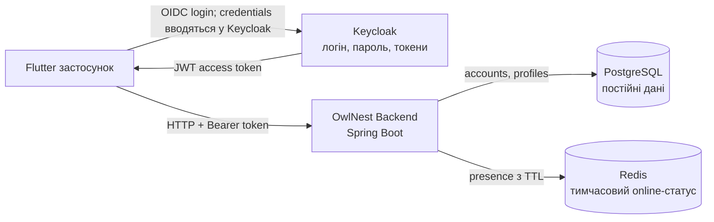
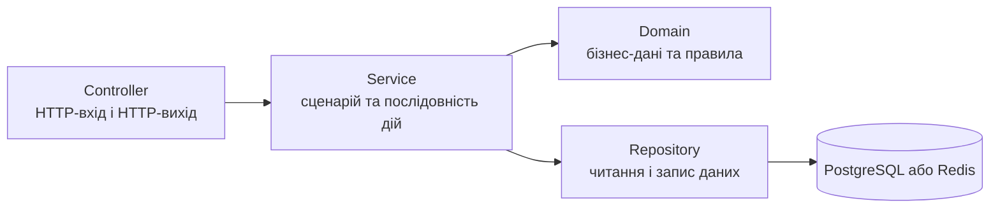
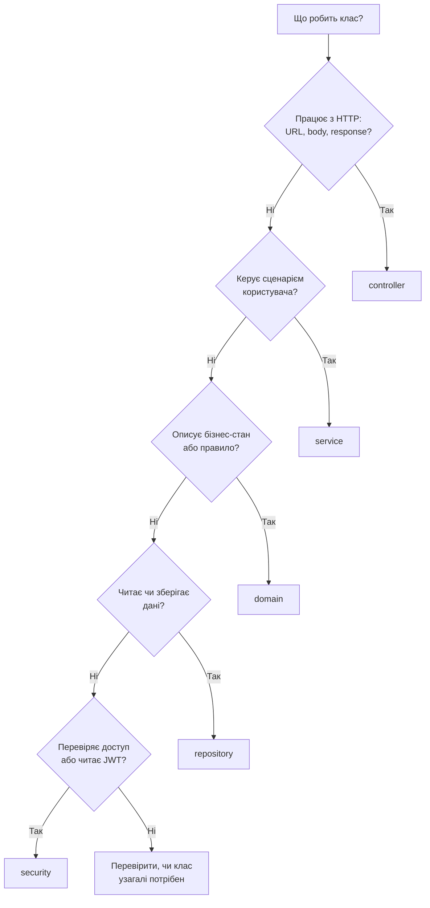
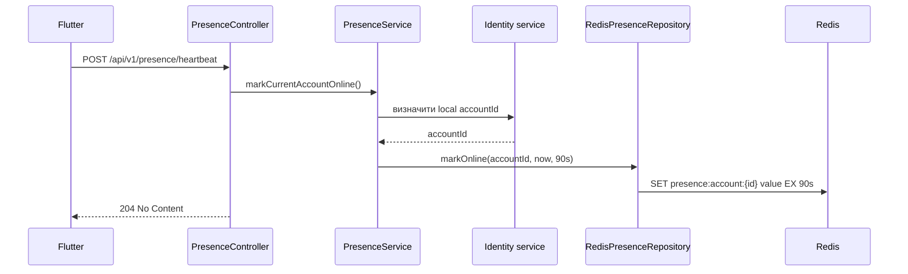
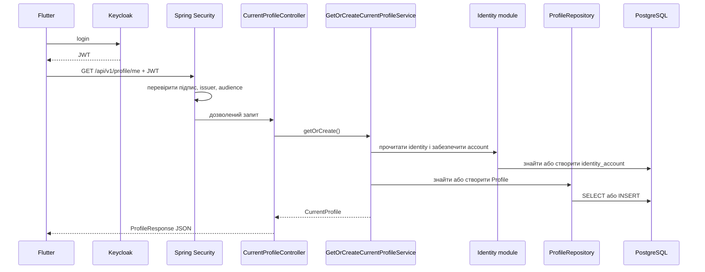

# Архітектура OwlNest Backend — навчальна шпаргалка

Це навчальний довідник по **реальній поточній структурі** OwlNest Backend. Його мета — допомогти швидко згадати, де шукати код, за що відповідає кожен пакет і як проходить запит від Flutter до бази даних.

Якщо якась назва забулася, спочатку повернися до двох правил:

1. `identity`, `profile`, `presence` — це **функціональні модулі**, тобто великі частини продукту.
2. `controller`, `service`, `domain`, `repository` — це **ролі коду всередині модуля**.

Наприклад, `profile` — це все, що стосується профілю. Усередині нього:

```text
profile/
├── controller/  # приймає HTTP-запити про профіль
├── service/     # виконує сценарії роботи з профілем
├── domain/      # описує сам профіль і його правила
└── repository/  # читає та зберігає профіль
```

## 1. Загальна картина за одну хвилину

OwlNest Backend — це **модульний моноліт**:

- один Spring Boot застосунок;
- один Gradle-проєкт;
- один процес backend;
- але код розділений на незалежні функціональні модулі.

Слово **моноліт** тут не означає «весь код змішаний». Воно означає, що всі модулі збираються і запускаються разом. Слово **модульний** означає, що кожна функція продукту має власну папку та відповідальність.



Найважливіше про авторизацію:

- пароль зберігає і перевіряє **Keycloak**;
- backend не отримує та не дублює пароль;
- Flutter отримує від Keycloak JWT-токен і додає його до запитів;
- backend перевіряє токен і працює зі своїм локальним `accountId`.

## 2. Два рівні організації коду

### Рівень 1: модуль відповідає на питання «про що цей код?»

| Модуль | Простими словами |
|---|---|
| `identity` | Хто зараз виконує запит і який локальний OwlNest-акаунт відповідає користувачу Keycloak. |
| `profile` | Який вигляд має профіль користувача і які його поля можна читати або змінювати. |
| `presence` | Чи вважається користувач зараз онлайн. |
| `foundation` | Загальні технічні налаштування застосунку, які не є окремою бізнес-функцією. Зараз тут конфігурація OpenAPI. |

Майбутні `post`, `feed`, `socialgraph`, `messaging` теж будуть окремими функціональними модулями.

### Рівень 2: пакет відповідає на питання «яку роботу виконує цей код?»



Це не чотири обов'язкові папки для кожного модуля. Створюємо лише ті, які справді потрібні. Наприклад, у `presence` зараз немає окремого `domain`, бо ще немає складної presence-моделі з власними бізнес-правилами.

## 3. Що означає кожен пакет

### `controller` — двері до backend

Controller приймає HTTP-запит від Flutter і повертає HTTP-відповідь.

Він відповідає за:

- URL і HTTP-метод: `GET`, `POST`, `PUT`;
- читання path-параметрів і JSON body;
- перевірку формату вхідних даних;
- виклик потрібного service;
- перетворення результату service у JSON-відповідь;
- перетворення очікуваних помилок у правильні HTTP-статуси.

Controller **не повинен** сам вирішувати бізнес-задачу або напряму працювати з базою.

Аналогія: controller — працівник на рецепції. Він приймає звернення, перевіряє, чи воно оформлене правильно, і передає його потрібному спеціалісту.

Приклади:

- `CurrentProfileController` приймає запити до `/api/v1/profile/me`;
- `PublicProfileController` віддає публічний профіль;
- `PresenceController` приймає heartbeat.

### `service` — виконавець сценарію

Service описує **що саме треба зробити** для конкретної дії користувача.

Він відповідає за:

- послідовність кроків одного сценарію;
- виклик repository;
- використання domain-правил;
- виклик публічного service іншого модуля, якщо це потрібно;
- межу транзакції для PostgreSQL;
- результат сценарію або зрозумілу бізнес-помилку.

Аналогія: service — менеджер процесу. Він знає, кого викликати і в якій послідовності, але не зберігає дані власноруч.

Важлива різниця з frontend: у Flutter словом `service` часто називають API-клієнт. У цьому backend `service` — передусім **сценарій роботи системи**. Наприклад: «отримати або створити мій профіль».

### `domain` — бізнес-поняття та їхні правила

Domain описує те, про що говорить сам продукт, а не HTTP чи конкретна база даних.

Він містить:

- сутності, наприклад `Account` і `Profile`;
- їхній стан;
- операції, які законно змінюють цей стан;
- типи зі скінченним набором значень, наприклад `Gender`.

Приклад: `Profile.completeOnboarding(...)` змінює поля профілю і позначає onboarding завершеним. Це поведінка самого профілю, тому вона знаходиться у domain.

У поточному проєкті `Account` і `Profile` одночасно є domain-об'єктами та JPA-сутностями. Це практичне спрощення для невеликого моноліту: ми не створюємо другу майже ідентичну модель лише заради «ідеально чистої» архітектури.

### `repository` — доступ до сховища

Repository приховує технічні деталі зберігання даних.

Service каже:

> Знайди профіль за `accountId`.

А repository уже знає, як це зробити через PostgreSQL, JPA або Redis.

У проєкті можна зустріти три частини:

1. `ProfileRepository` — наш простий інтерфейс із потрібними операціями.
2. `ProfileRepositoryImpl` — реалізація цього інтерфейсу.
3. `SpringDataProfileRepository` — інструмент Spring Data JPA, який генерує типові SQL-операції.

Для Redis структура простіша:

1. `PresenceRepository` — інтерфейс, який потрібен service.
2. `RedisPresenceRepository` — реалізація, яка використовує Redis.

Така межа дозволяє service думати про сценарій, а не про SQL, Redis-команди чи бібліотеки.

### `security` — охорона входу і читання токена

`security` — окремий технічний пакет, бо це не controller, не service і не repository.

Він відповідає за:

- правила доступу до URL;
- перевірку JWT до запуску controller;
- діставання `sub`, email та інших claims із перевіреного токена;
- перетворення Spring Security-об'єкта на зрозумілий для нашого коду `AuthenticatedIdentity`.

## 4. Головне правило залежностей

Нормальний напрямок викликів:

```text
Controller -> Service -> Repository interface -> Repository implementation -> Storage
                         \
                          -> Domain
```

Що це означає на практиці:

- controller викликає service, але не repository;
- service може використовувати repository та domain;
- repository не вирішує бізнес-сценарії;
- один модуль не повинен лізти напряму в repository іншого модуля;
- для взаємодії між модулями використовуємо публічний service іншого модуля.

Наприклад, `profile` має право викликати `PresenceService`, щоб додати online-статус до публічного профілю. Але `profile` не повинен напряму використовувати `RedisPresenceRepository`.

## 5. Як визначити, куди покласти новий клас



Спочатку обираємо **модуль за змістом**, а вже потім **пакет за роллю**. Наприклад, endpoint створення поста піде не в глобальний `controller`, а в `post/controller`.

## 6. Модуль `identity`

### Його відповідальність

`identity` пов'язує перевіреного користувача Keycloak із локальним OwlNest-акаунтом.

Keycloak і OwlNest зберігають різні речі:

- Keycloak знає credentials, email verification і зовнішній ідентифікатор `sub`;
- OwlNest створює власний UUID `accountId`, на який посилатимуться профілі, пости, друзі та повідомлення.

Це дозволяє не прив'язувати всю бізнес-базу напряму до формату одного identity provider.

### Класи `identity`

| Клас | Роль простими словами |
|---|---|
| `Account` | Локальний OwlNest-акаунт. Зберігає наш UUID, провайдера, Keycloak `sub`, email і часові поля. |
| `AuthenticatedIdentity` | Невеликий незмінний знімок даних із поточного JWT. |
| `CurrentIdentityProvider` | Інтерфейс: «дай мені користувача з поточного перевіреного запиту». |
| `SpringSecurityIdentityProvider` | Реалізація, яка читає JWT зі Spring Security і створює `AuthenticatedIdentity`. |
| `EnsureAccountExistsService` | Знаходить локальний account або створює його при першому запиті; також оновлює email і `lastSeenAt`. |
| `AccountRepository` | Описує потрібні операції читання і збереження account. |
| `AccountRepositoryImpl` | Передає ці операції до Spring Data JPA. |
| `SpringDataAccountRepository` | Spring Data-інтерфейс, для якого Spring автоматично створює реалізацію запитів. |
| `SecurityConfiguration` | Вимагає валідний JWT для `/api/v1/**`, залишає health та Swagger публічними і робить API stateless. |

### Чого `identity` не робить

- не приймає пароль користувача;
- не перевіряє пароль;
- не реєструє дубль користувача у Firebase;
- не видає access/refresh tokens;
- не зберігає Keycloak-сесію у backend.

Це відповідальність Keycloak та клієнтського login flow.

## 7. Модуль `profile`

### Його відповідальність

`profile` зберігає дані профілю, які належать саме OwlNest: username, display name, bio, дату народження, gender і стан onboarding.

Він також розділяє:

- **власний профіль**, де користувач бачить приватні поля на кшталт email і birth date;
- **публічний профіль**, де інші користувачі бачать лише безпечний набір полів.

### Класи `profile/controller`

| Клас | Роль простими словами |
|---|---|
| `CurrentProfileController` | Обслуговує `GET /profile/me` та `PUT /profile/me`. |
| `PublicProfileController` | Обслуговує `GET /profiles/{accountId}`. |
| `ProfileOnboardingRequest` | Форма вхідного JSON для створення або повної заміни профілю; містить validation-правила. |
| `ProfileResponse` | JSON-відповідь із власним профілем, включно з приватними полями поточного користувача. |
| `PublicProfileResponse` | Безпечна JSON-відповідь для перегляду чужого профілю. |
| `ProfileExceptionHandler` | Перетворює очікувані profile-помилки на `404` або `409` у форматі `ProblemDetail`. |

### Класи `profile/service`

| Клас | Роль простими словами |
|---|---|
| `GetOrCreateCurrentProfileService` | Основний сценарій власного профілю: читає identity, забезпечує account, створює default profile або оновлює onboarding. |
| `GetPublicProfileService` | Читає завершений публічний профіль і додає presence-статус. |
| `CompleteProfileOnboardingCommand` | Очищені й нормалізовані дані, з якими працює service після HTTP-валідації. |
| `CurrentProfile` | Результат service для власного профілю. Це ще не HTTP-відповідь. |
| `PublicProfile` | Результат service для публічного профілю. |
| `ProfileNotFoundException` | Зрозуміла помилка «завершений профіль не знайдено». |
| `UsernameAlreadyInUseException` | Зрозуміла помилка «username уже зайнятий». |

### Класи `profile/domain` і `profile/repository`

| Клас | Роль простими словами |
|---|---|
| `Profile` | Головна profile-сутність і JPA-модель таблиці `profile`. |
| `Gender` | Дозволений список значень gender. |
| `ProfileRepository` | Операції, які потрібні profile-services. |
| `ProfileRepositoryImpl` | Реалізує наш repository через Spring Data. |
| `SpringDataProfileRepository` | Дає готові JPA-операції й генерує перевірку унікальності username за назвою методу. |

### Навіщо тут Request, Command, Domain і Response

Вони схожі, але позначають різні межі:

```text
ProfileOnboardingRequest       HTTP-вхід від Flutter
            ↓
CompleteProfileOnboardingCommand  команда для service
            ↓
Profile                       стан і правила domain
            ↓
CurrentProfile                результат service
            ↓
ProfileResponse               HTTP-вихід для Flutter
```

Цей поділ не дає випадково:

- віддати назовні всі колонки database entity;
- прив'язати service до HTTP-анотацій;
- прийняти неперевірений JSON прямо у domain;
- показати приватні поля у публічному endpoint.

Не для кожної простої операції обов'язково потрібні всі п'ять типів. Додаємо окремий тип тоді, коли він справді захищає межу або робить код зрозумілішим.

## 8. Модуль `presence`

### Його відповідальність

`presence` відповідає лише на короткочасне питання: «цей account зараз онлайн?».

Flutter має надсилати heartbeat приблизно кожні 30 секунд, поки застосунок активний. Backend записує у Redis ключ із часом життя 90 секунд. Якщо нових heartbeat немає, Redis сам видаляє ключ, і користувач стає offline.



### Класи `presence`

| Клас | Роль простими словами |
|---|---|
| `PresenceController` | Приймає heartbeat і повертає `204 No Content`. |
| `PresenceExceptionHandler` | Якщо Redis недоступний під час heartbeat, повертає контрольовану помилку `503`. |
| `PresenceService` | Визначає поточний account, задає TTL 90 секунд, записує online або читає статус. |
| `PresenceStatus` | Три можливі результати: `ONLINE`, `OFFLINE`, `UNKNOWN`. |
| `PresenceRepository` | Не залежний від Redis контракт: позначити online або перевірити online. |
| `RedisPresenceRepository` | Записує і перевіряє ключі `presence:account:{accountId}` у Redis. |
| `PresenceRepositoryUnavailableException` | Ховає технічну Redis-помилку за зрозумілою для модуля помилкою. |

`UNKNOWN` потрібен для публічного профілю: якщо PostgreSQL працює, а Redis тимчасово впав, ми все одно можемо віддати профіль, але чесно сказати, що presence зараз невідомий.

## 9. Три реальні потоки запиту

### Потік A: отримати власний профіль



### Потік B: heartbeat

1. Spring Security перевіряє JWT.
2. `PresenceController` приймає запит.
3. `PresenceService` отримує локальний `accountId` через `identity`.
4. `RedisPresenceRepository` записує ключ із TTL 90 секунд.
5. Controller повертає `204` без body.

### Потік C: переглянути публічний профіль

1. `PublicProfileController` отримує `accountId` з URL.
2. `GetPublicProfileService` читає профіль із PostgreSQL.
3. Незавершений або відсутній profile дає `ProfileNotFoundException`.
4. Service викликає `PresenceService`, а не Redis repository напряму.
5. До публічних полів додається `ONLINE`, `OFFLINE` або `UNKNOWN`.
6. `PublicProfileResponse` не містить email, birth date або gender.

## 10. Де які дані живуть

| Сховище | Що там є | Чому саме там |
|---|---|---|
| Keycloak | Password hash, login, email verification, sessions, access/refresh tokens, зовнішній `sub`. | Це спеціалізований identity provider. Backend не повинен винаходити власне зберігання паролів. |
| PostgreSQL `identity_account` | Локальний UUID OwlNest, provider, external subject, email-копія, timestamps. | Це постійний зв'язок між зовнішньою identity та бізнес-даними OwlNest. |
| PostgreSQL `profile` | Username, display name, bio, birth date, gender, onboarding state. | Це довговічні продуктні дані та джерело правди для профілю. |
| Redis | Ключ `presence:account:{accountId}` і час останньої активності; ключ автоматично зникає. | Online-статус короткочасний, часто оновлюється і не повинен жити вічно. |

PostgreSQL — джерело правди для постійних бізнес-даних. Redis у цьому проєкті можна очистити без втрати акаунтів чи профілів: усі користувачі просто тимчасово стануть offline.

## 11. Основні анотації простими словами

Це коротка пам'ятка. Повний довідник є в [Annotation Glossary](annotations.md).

| Анотація | Що означає в нашому коді |
|---|---|
| `@RestController` | Spring має створити controller і повертати результат його методів як HTTP body, зазвичай JSON. |
| `@RequestMapping` | Спільна частина URL і налаштувань для controller. |
| `@GetMapping`, `@PostMapping`, `@PutMapping` | Прив'язують Java-метод до HTTP-методу та URL. |
| `@RequestBody` | Прочитати JSON body у Java-об'єкт. |
| `@PathVariable` | Прочитати значення зі змінної частини URL. |
| `@Valid` | Запустити Jakarta Validation для request перед методом controller. |
| `@NotBlank`, `@Size`, `@Pattern`, `@Past` | Правила перевірки окремих полів request. |
| `@Service` | Зареєструвати клас сценарію як Spring bean. |
| `@Repository` | Зареєструвати реалізацію доступу до даних як Spring bean. |
| `@Transactional` | Виконати метод у PostgreSQL-транзакції; при необробленій runtime-помилці зміни відкочуються. |
| `@Entity` | JPA має зіставити Java-клас із рядком таблиці. |
| `@Table` | Налаштовує таблицю та її constraints. |
| `@Id` | Поле є primary key сутності. |
| `@Column` | Налаштовує відповідну колонку. |
| `@Enumerated(EnumType.STRING)` | Зберігати enum як текст, наприклад `FEMALE`, а не як нестабільний номер. |
| `@Configuration` | Клас містить Spring-конфігурацію. |
| `@Bean` | Результат методу треба додати до Spring context як керований об'єкт. |
| `@Component` | Загальна анотація для Spring-класу, коли точніша роль `Service` або `Repository` не підходить. |
| `@RestControllerAdvice` | Централізовано обробляти помилки controller. |
| `@ExceptionHandler` | Вказує, яку exception перетворює конкретний метод. |

OpenAPI-анотації `@Operation`, `@ApiResponse`, `@Tag` і `@SecurityRequirement` не виконують бізнес-логіку. Вони описують endpoint для Swagger/OpenAPI.

## 12. Java-типи, які часто зустрічаються

| Тип | Коли використовуємо |
|---|---|
| `class` | Коли об'єкт має стан, поведінку, залежності або життєвий цикл. Наприклад, service чи entity. |
| `record` | Для компактних незмінних даних: request, command, result, response. |
| `interface` | Щоб описати контракт без прив'язки до конкретної реалізації. Наприклад, repository. |
| `enum` | Для закритого списку дозволених значень. |

Spring передає залежності через constructor injection:

```java
public PresenceService(PresenceRepository presenceRepository) {
    this.presenceRepository = presenceRepository;
}
```

Service просить інтерфейс `PresenceRepository`, а Spring підставляє знайдену реалізацію `RedisPresenceRepository`.

## 13. Технічні файли поза модулями

| Файл або папка | Роль |
|---|---|
| `OwlnestBackendApplication` | Точка запуску Spring Boot. |
| `foundation/openapi/OpenApiConfiguration` | Групи та security-схеми Swagger/OpenAPI. |
| `application.yaml` | Налаштування JPA, Redis, JWT і Swagger. |
| `db/migration/` | Версійні SQL-міграції Flyway. Вони створюють і змінюють структуру PostgreSQL. |
| `compose.yaml` | Локальні контейнери PostgreSQL, Keycloak, Redis і backend. |
| `src/test/java` | Тести, структура яких повторює main-код, щоб потрібний тест було легко знайти. |

JPA `ddl-auto: validate` не створює таблиці. Структуру змінюють Flyway-міграції, а Hibernate лише перевіряє, чи entity відповідають готовій схемі.

## 14. Поточні HTTP endpoints

| Метод і URL | Controller | Service | Сховище |
|---|---|---|---|
| `GET /api/v1/profile/me` | `CurrentProfileController` | `GetOrCreateCurrentProfileService` | PostgreSQL |
| `PUT /api/v1/profile/me` | `CurrentProfileController` | `GetOrCreateCurrentProfileService` | PostgreSQL |
| `GET /api/v1/profiles/{accountId}` | `PublicProfileController` | `GetPublicProfileService` + `PresenceService` | PostgreSQL + Redis |
| `POST /api/v1/presence/heartbeat` | `PresenceController` | `PresenceService` | Redis, а при першому запиті також PostgreSQL account |

Усі `/api/v1/**` endpoints потребують валідний Bearer JWT.

## 15. Шаблон для майбутньої функції

Приклад для майбутнього створення поста:

```text
post/
├── controller/
│   ├── PostController.java
│   ├── CreatePostRequest.java
│   └── PostResponse.java
├── service/
│   ├── CreatePostService.java
│   └── CreatePostCommand.java
├── domain/
│   └── Post.java
└── repository/
    ├── PostRepository.java
    ├── PostRepositoryImpl.java
    └── SpringDataPostRepository.java
```

Перед додаванням класу корисно поставити собі питання:

1. До якої функції продукту він належить?
2. Це HTTP-межа, сценарій, бізнес-модель чи доступ до даних?
3. Чи controller лише перекладає HTTP і викликає service?
4. Чи service описує зрозумілий сценарій?
5. Чи бізнес-правило знаходиться в domain, а не розкидане по controllers?
6. Чи service залежить від repository-інтерфейсу?
7. Чи приватні поля не потрапляють у public response?
8. Чи зміна PostgreSQL має Flyway-міграцію?
9. Чи endpoint має тести та OpenAPI-опис?
10. Чи документація відповідає реальному коду?

## 16. Найкоротша формула для повторення

```text
Модуль       = про яку функцію продукту цей код.
Controller   = прийняв HTTP-запит і повернув HTTP-відповідь.
Service      = виконав сценарій у правильній послідовності.
Domain       = описав бізнес-дані та правила.
Repository   = прочитав або зберіг дані.
Security     = перевірив доступ і пояснив системі, хто користувач.
Keycloak     = credentials і токени.
PostgreSQL   = постійні дані.
Redis        = швидкі тимчасові дані.
```

Якщо можеш своїми словами пояснити шлях `Controller -> Service -> Repository -> Storage`, а також різницю між `identity` і `security`, то основну архітектуру поточного backend ти вже розумієш.
