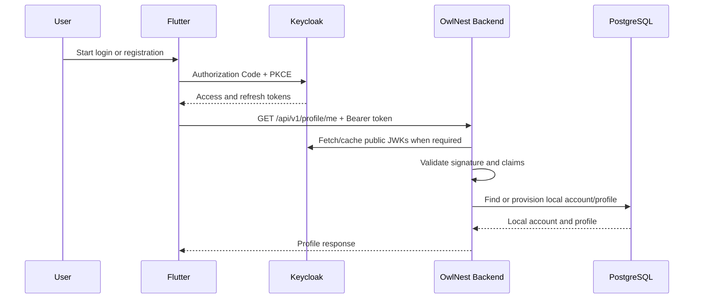

# Authentication

**Status:** Implemented and verified in the local Docker stack.

## Purpose and Terminology

Authentication answers “who is making this request?” Authorization answers “what may this identity do?” Keycloak authenticates the person and issues tokens. OwlNest Backend validates those tokens and applies product authorization rules.

## System Boundary



## Responsibilities

### Keycloak

- registration and credential verification;
- password reset and email verification;
- access, refresh, and ID token issuance;
- token signing keys and OpenID Connect metadata;
- client and redirect-URI configuration.

### Flutter

- start Authorization Code flow with PKCE;
- receive the redirect and exchange the code;
- store tokens using platform-secure storage;
- refresh or clear tokens through the identity provider;
- attach the access token as `Authorization: Bearer ...`.

### OwlNest Backend

- validate JWT signature, `iss`, `aud`, `exp`, and `nbf`;
- read stable identity from `sub` and selected profile claims;
- map external identity to a local UUID;
- protect endpoints and enforce ownership/roles;
- return consistent `401` and `403` responses;
- never receive or store a user's Keycloak password.

## Token Contract

Required access-token claims:

| Claim | Meaning | Backend behavior |
| --- | --- | --- |
| `iss` | Token issuer | Must equal the configured canonical Keycloak realm issuer. |
| `sub` | Stable Keycloak user identifier | Used only for the identity mapping, never as a business-table primary key. |
| `aud` | Intended API audience | Must contain `owlnest-api`. |
| `exp` | Expiration | Expired tokens receive `401`. |
| `nbf` | Not valid before | Premature tokens receive `401`. |
| `email` | Account email | Copied to the local account when present. |
| `email_verified` | Verification state | Stored locally; the initial local realm permits unverified email until SMTP is configured. |
| `preferred_username` | Keycloak-facing username | Available to identity services but never becomes public profile data before explicit OwlNest onboarding. |

The backend must not trust a claim merely because it exists; signature, issuer, audience, and time validation happen first.

## Local Account Model

Keep identity and public profile separate:

```text
identity_account
├── id UUID primary key
├── provider VARCHAR
├── external_subject VARCHAR
├── email VARCHAR
├── email_verified BOOLEAN
├── created_at TIMESTAMPTZ
└── last_seen_at TIMESTAMPTZ

profile
├── account_id UUID primary/foreign key
├── username VARCHAR unique
├── display_name VARCHAR
├── bio VARCHAR nullable
├── created_at TIMESTAMPTZ
└── updated_at TIMESTAMPTZ
```

`(provider, external_subject)` is unique. Posts, comments, friendships, and messages reference the local account UUID. This prevents Keycloak replacement or realm migration from rewriting all business foreign keys.

## First Vertical Slice

The first backend feature is not a login endpoint. It is:

```http
GET /api/v1/profile/me
Authorization: Bearer <access-token>
```

On the first valid request, the application explicitly provisions the local account and profile if missing. Later requests reuse them. Provisioning is called from the `/profile/me` use case rather than a global servlet filter, keeping the database write visible, transactional, and easy to test.

Initial behavior:

- no token or malformed token → `401 Unauthorized`;
- valid token and existing account → `200 OK`;
- valid token and first visit → create account/profile, then `200 OK`;
- authenticated identity without required permission → `403 Forbidden`;
- duplicate provisioning race → miss-only PostgreSQL transaction advisory locks plus a recheck serialize first account/profile creation; established identities remain lock-free.

## Configuration and Networking

The development stack includes Keycloak with a versioned realm import. One canonical issuer is used in tokens and validation. The URL visible to Flutter differs from the container-network URL used to download JWKs, so `issuer-uri` and `jwk-set-uri` are configured separately while issuer validation remains strict.

Do not finalize a `localhost` issuer until iOS simulator, Android emulator/device, local backend, and full Docker stack access paths are agreed. A mismatched issuer is an authentication failure even when the JWK endpoint is reachable.

## Email Verification and SMTP

**Current state:** no SMTP service is configured and the development realm keeps `verifyEmail: false`. Email/password login therefore works without sending email.

**Planned development setup:** add Mailpit to Docker Compose and configure Keycloak to use it as the local SMTP server. Mailpit will capture verification and password-reset messages and expose them through its local web interface; it is not a production email provider.

SMTP becomes required before enabling email verification or self-service password reset because Keycloak must deliver verification and reset links. Production will use a transactional email provider rather than Mailpit. Do not enable mandatory verification until mail delivery is configured and tested, or new users can be locked out.

## Registration and Extended Profile Fields

Keycloak can run self-registration and collect built-in `firstName` and `lastName` fields plus custom attributes defined through its User Profile configuration. Required rules, validation, and who may view or edit each attribute can be configured there.

The application's login page is the Keycloak authorization page for `owlnest-flutter`, not the Admin Console or Account Console. Flutter opens that page through Authorization Code + PKCE; the normal login form exposes a Register link, while `prompt=create` opens registration directly.

Swagger UI uses a separate public client named `owlnest-swagger`, restricted to `http://localhost:8080/swagger-ui/oauth2-redirect.html` and PKCE S256. This lets API documentation perform the same browser-based login without reusing Flutter/Postman redirect URIs or storing a client secret. Login and refresh remain Keycloak token-protocol operations rather than OwlNest REST controllers.

For local browser convenience, the custom Keycloak welcome theme redirects `http://localhost:8081` to the OwlNest Account Console. The Account Console then starts its own secure authorization flow, so developers can enter through the short root URL without hard-coding an authentication-session URL. The Admin Console remains available at `http://localhost:8081/admin/`.

The `owlnest` login theme inherits Keycloak's maintained `keycloak.v2` templates and overrides only CSS and brand assets. Sign in, registration, password recovery, and related authentication pages therefore share the warm OwlNest visual language without copying security-sensitive form templates into the repository.

For OwlNest, keep the ownership boundary explicit:

- Keycloak owns credentials and login identity: email, password, verification state, and optionally first/last name.
- PostgreSQL owns product profile data: username, display name, bio, birth date, gender, avatar settings, and future social preferences.
- Store `birthDate`, not mutable `age`; calculate age when needed.
- Complete product-specific fields through an authenticated OwlNest onboarding endpoint after Keycloak registration.

Custom Keycloak attributes can later be mapped into token claims and copied to PostgreSQL, but avoid placing sensitive or frequently changing profile data in access tokens. A minimal incomplete profile uses generated `user_<id>` and neutral `OwlNest user`; only explicit onboarding chooses public username/display name.

The accepted follow-up contract is documented in [Profile Onboarding](profile-onboarding.md).

## Security Defaults

- stateless server sessions;
- CSRF disabled only for the bearer-token API because credentials are not cookie-based;
- `/actuator/health` public;
- `/api/v1/**` authenticated by default;
- least-privilege roles and scopes;
- no tokens or sensitive claims in logs;
- TLS required outside local development;
- UTC timestamps and a small, explicit clock-skew policy.

## Verification Coverage

- MVC integration tests for missing, malformed, and valid bearer authentication;
- a unit test for mapping validated JWT claims into a provider-neutral identity;
- PostgreSQL Testcontainers coverage for first and repeated `/profile/me` provisioning;
- a live Keycloak smoke flow for token issuance, refresh, JWT validation, and the protected profile endpoint.

Role-specific `403` coverage will be added with the first endpoint that requires an authority; no such rule exists yet. Flutter Authorization Code + PKCE end-to-end coverage remains pending until the client flow is implemented.

## Non-goals for the First Slice

- social login;
- admin roles and moderation;
- custom token issuance;
- Keycloak event listeners or webhooks;
- automatic provisioning on every request through a custom filter;
- account deletion synchronization;
- production Keycloak deployment design.
