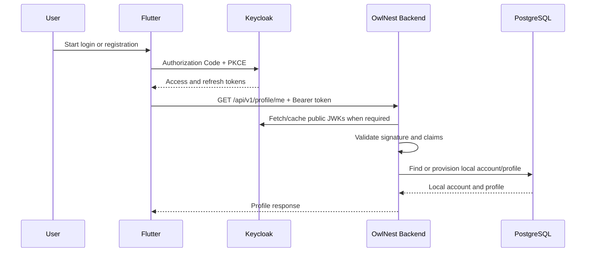

# Authentication

**Status:** Draft — implementation has not started.

## Purpose and Terminology

Authentication answers “who is making this request?” Authorization answers “what may this identity do?” Keycloak authenticates the person and issues tokens. OwlNest Backend validates those tokens and applies product authorization rules.

## System Boundary



## Responsibilities

### Keycloak

- registration and credential verification;
- password reset and email verification;
- access, refresh, and ID token issuance;
- token signing keys and OpenID Connect metadata;
- client and redirect-URI configuration.

### Flutter

- start Authorization Code flow with PKCE;
- receive the redirect and exchange the code;
- store tokens using platform-secure storage;
- refresh or clear tokens through the identity provider;
- attach the access token as `Authorization: Bearer ...`.

### OwlNest Backend

- validate JWT signature, `iss`, `aud`, `exp`, and `nbf`;
- read stable identity from `sub` and selected profile claims;
- map external identity to a local UUID;
- protect endpoints and enforce ownership/roles;
- return consistent `401` and `403` responses;
- never receive or store a user's Keycloak password.

## Token Contract

Required access-token claims:

| Claim | Meaning | Backend behavior |
| --- | --- | --- |
| `iss` | Token issuer | Must equal the configured canonical Keycloak realm issuer. |
| `sub` | Stable Keycloak user identifier | Used only for the identity mapping, never as a business-table primary key. |
| `aud` | Intended API audience | Must contain `owlnest-api`. |
| `exp` | Expiration | Expired tokens receive `401`. |
| `nbf` | Not valid before | Premature tokens receive `401`. |
| `email` | Account email | Copied to the local account when present. |
| `email_verified` | Verification state | The first version should reject unverified accounts when email is required. |
| `preferred_username` | Keycloak-facing username | May seed a profile but does not replace OwlNest username rules. |

The backend must not trust a claim merely because it exists; signature, issuer, audience, and time validation happen first.

## Local Account Model

Keep identity and public profile separate:

```text
identity_account
├── id UUID primary key
├── provider VARCHAR
├── external_subject VARCHAR
├── email VARCHAR
├── email_verified BOOLEAN
├── created_at TIMESTAMPTZ
└── last_seen_at TIMESTAMPTZ

profile
├── account_id UUID primary/foreign key
├── username VARCHAR unique
├── display_name VARCHAR
├── bio VARCHAR nullable
├── created_at TIMESTAMPTZ
└── updated_at TIMESTAMPTZ
```

`(provider, external_subject)` is unique. Posts, comments, friendships, and messages reference the local account UUID. This prevents Keycloak replacement or realm migration from rewriting all business foreign keys.

## First Vertical Slice

The first backend feature is not a login endpoint. It is:

```http
GET /api/v1/profile/me
Authorization: Bearer <access-token>
```

On the first valid request, the application explicitly provisions the local account and profile if missing. Later requests reuse them. Provisioning is called from the `/profile/me` use case rather than a global servlet filter, keeping the database write visible, transactional, and easy to test.

Initial behavior:

- no token or malformed token → `401 Unauthorized`;
- valid token and existing account → `200 OK`;
- valid token and first visit → create account/profile, then `200 OK`;
- authenticated identity without required permission → `403 Forbidden`;
- duplicate provisioning race → one account wins through the database unique constraint; the request reloads it.

## Configuration and Networking

Implementation will add a Keycloak service and development realm import. One canonical issuer must be used in tokens and validation. The URL visible to Flutter may differ from the container-network URL used to download JWKs, so `issuer-uri` and `jwk-set-uri` may be configured separately while issuer validation remains strict.

Do not finalize a `localhost` issuer until iOS simulator, Android emulator/device, local backend, and full Docker stack access paths are agreed. A mismatched issuer is an authentication failure even when the JWK endpoint is reachable.

## Security Defaults

- stateless server sessions;
- CSRF disabled only for the bearer-token API because credentials are not cookie-based;
- `/actuator/health` public;
- `/api/v1/**` authenticated by default;
- least-privilege roles and scopes;
- no tokens or sensitive claims in logs;
- TLS required outside local development;
- UTC timestamps and a small, explicit clock-skew policy.

## Testing Strategy

- MVC security tests for missing, invalid, valid, and insufficient JWTs;
- unit tests for claim-to-identity mapping and provisioning decisions;
- PostgreSQL Testcontainers integration tests for uniqueness and transactions;
- controller integration test for first and repeated `/profile/me` calls;
- one live Keycloak smoke test after local realm wiring is implemented;
- Flutter end-to-end verification only after the backend contract is green.

## Non-goals for the First Slice

- social login;
- admin roles and moderation;
- custom token issuance;
- Keycloak event listeners or webhooks;
- automatic provisioning on every request through a custom filter;
- account deletion synchronization;
- production Keycloak deployment design.
